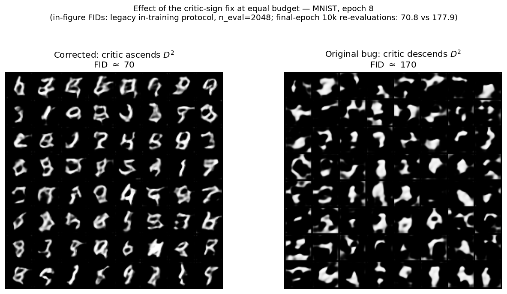
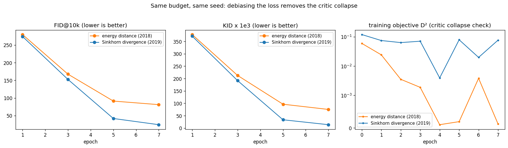
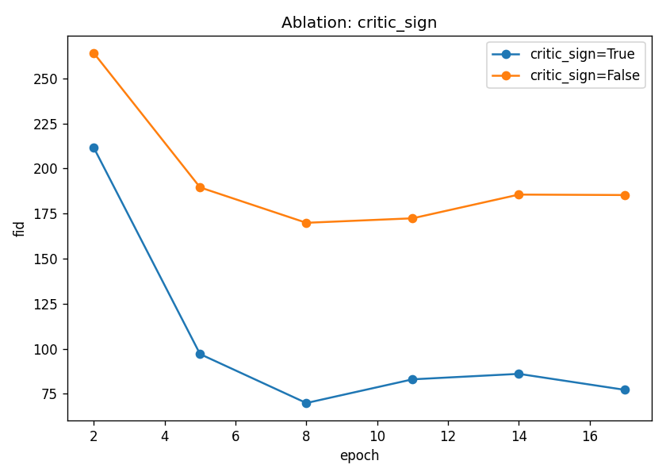

# OT-GAN: Improving GANs with Optimal Transport — corrected, modernized, measured

[](https://github.com/dan-allouche-qf/optimal-transport-gan/actions/workflows/ci.yml)
[](https://www.python.org/)
[](LICENSE)
[](https://github.com/dan-allouche-qf/optimal-transport-gan/releases)

We re-implemented OT-GAN (Salimans et al., ICLR 2018) and found the critic trained in the
**wrong direction** — one of five bugs, each now fixed and locked by a test. We then took the
same OT engine forward to 2019 (the debiased Sinkhorn divergence: FID 81.2 → 24.4 at equal
budget) and to 2024 (optimal-transport flow matching: FID 11.4), and sideways to market data
(scenario reduction, a GJR-GARCH returns generator) — all measured under one evaluation harness.

---

## Results at a glance

FID/KID on 10,000 samples (torchmetrics InceptionV3 + an MNIST-trained LeNet), single seed,
Apple Silicon (MPS) laptop budgets. Canonical source: [`assets/headline_results.md`](assets/headline_results.md).

| model | budget | FID@10k | KIDx1e3 | FID-LeNet | IS |
|---|---|---|---|---|---|
| OT-GAN, buggy critic sign (final, 18 ep) | ~6 h MPS | 177.9 | 191.0 | 208.8 | 2.34 |
| OT-GAN, corrected (final, 18 ep) | ~6 h MPS | 70.8 | 65.7 | 77.0 | 2.33 |
| OT-GAN, energy distance (8 ep) | ~3.5 h MPS | 81.2 | 75.3 | 69.1 | 2.33 |
| OT-GAN, Sinkhorn divergence (8 ep) | ~3.5 h MPS | 24.4 | 13.8 | 60.1 | 1.98 |
| DCGAN baseline (10 ep) | ~15 min MPS | 72.3 | 74.6 | 36.8 | 2.19 |
| I-CFM, no coupling (30 ep) | ~1.2 h MPS | 10.9 | 8.9 | 12.8 | 1.91 |
| OT-CFM, Sinkhorn coupling (30 ep) | ~1.2 h MPS | 11.4 | 9.6 | 12.6 | 1.90 |
| *train-vs-test floor* | - | 1.45 | - | 1.76 | - |

Corrected vs buggy critic (left), and the energy-distance vs Sinkhorn-divergence
comparison at equal budget (right shows the critic collapse disappearing):





> **How to read these numbers.**
> - **Laptop budgets, one harness.** Every row is trained and evaluated through the same
>   pipeline (`otgan/metrics.py`), n_eval = 10,000 per side, on an Apple M3 (MPS; metrics
>   forced to CPU). These are **controlled comparisons, not SOTA claims**.
> - **FID is implementation-dependent.** Resizing and quantization choices shift FID
>   (Parmar et al., CVPR 2022), and FID is biased in the sample count (Chong & Forsyth,
>   CVPR 2020) — hence one fixed torchmetrics InceptionV3 path, one fixed n, and an
>   explicit train-vs-test floor (1.45 Inception / 1.76 LeNet).
> - **Inception features are weak on MNIST.** Two proofs from our own table: (1) IS is
>   2.34 vs 2.33 for the buggy and corrected models — *identical* on a night-and-day
>   visual difference — so IS is demoted to a sanity check; (2) the DCGAN baseline beats
>   the corrected OT-GAN on FID-LeNet (36.8 vs 77.0) while roughly tying on Inception FID
>   (72.3 vs 70.8) — the two feature spaces **disagree**, which is why we report both.
> - **External context.** Lucic et al. (NeurIPS 2018) report WGAN ≈ 6.7 and WGAN-GP ≈ 20.3
>   on MNIST at much larger budgets (their floor ≈ 1.25, ours 1.45). Published FIDs are not
>   comparable across evaluators; the DCGAN row is our same-evaluator calibration point.
> - **Legacy numbers.** Earlier figures of 77.2 (final), 69.9 (best) and 185.3 (buggy) used
>   the old n_eval = 2048 protocol — see [`assets/ablation_table.md`](assets/ablation_table.md);
>   the raw per-epoch histories of both legacy runs are committed as
>   [`assets/history_critic_sign_on.csv`](assets/history_critic_sign_on.csv) /
>   [`history_critic_sign_off.csv`](assets/history_critic_sign_off.csv) so every legacy
>   figure is re-plottable without ~12 h of recompute. Any mention of these numbers is
>   labeled "legacy protocol, n_eval=2048".

---

## The five bugs

The original notebook implementation contained five bugs. Each fix is locked by a named test.

| # | Severity | Original bug | Fix | Locked by |
|---|---|---|---|---|
| 1 | critical | **Critic trained in the wrong direction**: a single loss was *descended* by both optimizers, while the critic must **maximize** the energy distance. | Critic performs gradient **ascent** (`(-D²).backward()`), generator descent. Toggleable via `critic_sign` so the ablation can compare ON/OFF. | `tests/test_trainer_smoke.py` (`test_critic_ascends_energy_distance`, `test_critic_sign_false_reproduces_bug`) |
| 2 | critical | **Hard-coded `.cuda()`** — crashed on anything but CUDA (Mac/CPU). | `resolve_device()` (CUDA → MPS → CPU); models and tensors placed via `.to(device)`. | `tests/test_device.py` |
| 3 | major | **Scale mismatch**: generator outputs `Tanh ∈ [-1,1]` vs images in `[0,1]` — the critic could cheat on brightness alone. | `Normalize((0.5,), (0.5,))` in the data pipeline; de-normalization for display. | `tests/test_data.py` (`test_build_transform_*_range`) |
| 4 | major | `DoubleBatchDataset(batch, batch)` fed **`X == X'`**, so the self-term `E[W(X, X')] ≈ 0` instead of a real baseline. | Two **independent** real minibatches per step (`2·B` images split into disjoint halves). | `tests/test_data.py` (`test_split_real_pair_exact_disjoint_halves`) |
| 5 | major | **Sinkhorn in the exponential domain** (`exp(-C/ε)`) — under/overflow for small ε. | **Log-domain** Sinkhorn (`logsumexp`); plan detached by the envelope theorem, gradients flow through the cost matrix. | `tests/test_sinkhorn.py` (`test_no_overflow_small_epsilon`, `test_plan_detached_gradient_flows_through_cost`) |

Quality levers added on top: Gaussian latent noise, an EMA generator, fixed-noise sample
grids, TensorBoard + CSV logging.

FID across epochs for the critic-sign ablation (legacy protocol, n_eval=2048; final 77.2 vs
185.3, best 69.9 at epoch 8):



---

## What the objective really is

OT-GAN minimizes the **minibatch energy distance** over critic embeddings:

$$D^2(p, g) = 2\,\mathbb{E}[\mathcal{W}_c(X, Y)] - \mathbb{E}[\mathcal{W}_c(X, X')] - \mathbb{E}[\mathcal{W}_c(Y, Y')]$$

where $\mathcal{W}_c$ is the entropic OT cost (Sinkhorn; Cuturi, NeurIPS 2013) under the
cosine cost on the critic's L2-normalized embedding. The generator minimizes $D^2$, the
critic maximizes it.

The 2019 reading: **$D^2$ is exactly 2× a Sinkhorn divergence whose self-terms are estimated
with *independent* minibatches** ($W(X, X')$). The debiased Sinkhorn divergence
(Genevay, Peyré & Cuturi, AISTATS 2018; Feydy et al., AISTATS 2019) uses *same-batch*
self-terms ($W(X, X)$):

$$S_\varepsilon(p, g) = \mathcal{W}_\varepsilon(p, g) - \tfrac{1}{2}\mathcal{W}_\varepsilon(p, p) - \tfrac{1}{2}\mathcal{W}_\varepsilon(g, g)$$

Both are implemented in [`otgan/energy.py`](otgan/energy.py) (the single source of truth for
the objective) and selected by config: `loss: energy_distance | sinkhorn_divergence`.

**The experiment:** swapping in the debiased self-terms at strictly equal budget
(8 epochs, same seed, same everything else) gives **FID 81.2 → 24.4** and
**KIDx1e3 75.3 → 13.8** — and the documented critic collapse disappears ($D^2$ holds at
~0.077 instead of collapsing to ~0.0001). See [`assets/loss_comparison.png`](assets/loss_comparison.png)
above. The Sinkhorn-divergence run was still improving when the 8-epoch budget ended.

Two intentional deviations from Feydy et al.'s exact framework are documented in
`otgan/energy.py`: the per-pair cost is the biased primal entropic cost $\langle M, C\rangle$
(as in the OT-GAN paper), and marginals are uniform over the minibatch. The log-domain
Sinkhorn plans are cross-validated against POT (`ot.sinkhorn`) in
`tests/test_sinkhorn_divergence.py`.

---

## Where this sits in 2026

OT-GAN is superseded — the point of this repo is a **measured tour of minibatch optimal
transport for generation, 2018 → 2024**, with one solver and one evaluation harness.

**OT-CFM (Tong et al., TMLR 2024).** Flow matching (Lipman et al., ICLR 2023) trains a
vector field by plain regression; OT-CFM pairs noise with data through a minibatch OT plan,
which straightens the flow and cuts integration error. [`otgan/cfm.py`](otgan/cfm.py)
implements it self-contained (no torchcfm dependency), reusing **the same
[`otgan/sinkhorn.py`](otgan/sinkhorn.py) solver** that priced minibatches inside the 2018
adversarial loss — six years apart, same log-domain loop. `cfm_coupling` selects
`sinkhorn` | `exact` (POT network simplex) | `none` (the I-CFM control with independent
pairs, isolating what the OT coupling buys at identical capacity and budget). Result:
**FID 11.4 / KIDx1e3 9.6 / FID-LeNet 12.6 in ~1.2 h** — no critic, no minimax — with the
I-CFM control landing at 10.9: at this scale the coupling itself is a wash (see the NFE
table below for the full picture).

NFE sweep (Euler steps at sampling time vs quality, best checkpoints):

| NFE | OT-CFM FID@10k | OT-CFM KIDx1e3 | OT-CFM FID-LeNet | I-CFM FID@10k |
|---|---|---|---|---|
| 10 | 13.5 | 11.3 | 34.6 | 13.3 |
| 50 | **10.8** | **8.7** | 15.2 | – |
| 100 | 11.1 | 9.1 | **13.6** | 10.9 |

One cost the budget column hides: the GAN generator is a **single forward pass (1 NFE)**
per sample, while flow matching pays `ode_steps` forward passes — training budget is not
the whole cost story.

Two honest readings. **(1) Flow matching samples cheaply on Inception FID** (ten-step Euler
costs only ≈ +2.7 FID over the 50-step sweet spot) **but not in the domain-aware feature
space**: FID-LeNet degrades ≈2.5x at ten steps (34.6 vs 13.6). **(2) The OT coupling is a
wash here**: the I-CFM control matches OT-CFM at both NFE 10 and NFE 100 — a null result
at this scale. Minibatch plans over 256 MNIST images are a weak approximation of the
global OT map, and Tong et al.'s gains concentrate in trajectory straightness,
very-low-NFE regimes and harder
datasets. The engineering point stands regardless: the same log-domain Sinkhorn loop
drives the 2018 adversarial loss and the 2024 coupling, and the control needed one config
override (`cfm_coupling=none`) to run. Repeat evaluations of the same checkpoint differ
by ≈ ±0.3 FID (11.4 in-training vs 11.1 here at NFE 100) — treat sub-unit gaps as noise.

One-liner for 2026 context: R3GAN ("The GAN is dead; long live the GAN!", NeurIPS 2024)
shows that GANs with a well-posed relativistic loss and modern backbones are competitive
again — the 2018 OT machinery is a waypoint worth understanding, not the frontier.

---

## From images to markets

[`otgan/finance/`](otgan/finance) points the **same engine** at simulated market data,
reusing the image pipeline verbatim by direct import: `otgan.sinkhorn.sinkhorn`,
`otgan.energy.energy_distance` / `compute_loss`, `otgan.ema.EMAGenerator`,
`otgan.data.split_real_pair`, `otgan.device.seed_everything`. Zero new dependencies,
CPU by default.

- **Scenario reduction** (`otgan finance-reduce`, zero training): pick K=100 representative
  paths out of N=10,000 with a Sinkhorn-k-means reduction built on the GAN's solver. It beats
  random subsampling on transport distortion (random is ~37% worse: 0.0120 vs 0.0088) and
  is on par with k-means (single run, no error bars), on distortion and on held-out tail
  estimates (CVaR 0.95/0.99) —
  full table in [`assets/finance/reduction_table.md`](assets/finance/reduction_table.md).
- **Returns generator** (`otgan finance-train`): a 1D OT-GAN (GLU generator, dilated-conv
  CReLU critic — a deliberate structural rhyme with the image models) learns GJR-GARCH(1,1)
  log-return paths (Glosten, Jagannathan & Runkle, 1993). At a **~5.5-minute CPU budget**
  every headline stylized-fact *sign* is right (the near-zero long-lag ACF rows fluctuate
  around zero) — fat tails, near-zero return ACF, positive volatility
  clustering, negative leverage (-0.29) — with honest caveats: magnitudes overshoot (excess
  kurtosis +7.07 vs target +1.00; |r| ACF too strong at short lags). Table:
  [`assets/finance/stylized_facts.md`](assets/finance/stylized_facts.md); figures:
  [fan chart](assets/finance/fan_chart.png), [ACF overlay](assets/finance/acf_overlay.png),
  [QQ plot](assets/finance/qq_plot.png).
- **Critic-sign replay in 1D**: `--override critic_sign=false` replays the headline bug on
  return paths in **minutes** instead of ~12 hours — same failure mode, tiny budget.

Executed notebooks: [`examples/scenario_reduction.ipynb`](examples/scenario_reduction.ipynb)
and [`examples/returns_generation.ipynb`](examples/returns_generation.ipynb).

Related work this track is positioned against: COT-GAN (Xu et al., NeurIPS 2020), Quant GANs
(Wiese et al., 2020), Tail-GAN (Cont et al.), Sig-WGAN (Ni et al., ICAIF 2021).

**Out of scope here — natural next steps:** causal/adapted OT, conditional generation,
signature features, multi-asset dependence, bundling real market data.

---

## Install

```bash
git clone https://github.com/dan-allouche-qf/optimal-transport-gan.git
cd optimal-transport-gan
pip install -e ".[dev]"
```

Python ≥ 3.10. Main dependencies: `torch`, `torchvision`, `torchmetrics[image]`, `numpy`,
`pyyaml`, `matplotlib`, `tensorboard`; `pot` (dev extra) for the cross-validation tests and
the exact CFM coupling. Runs on CPU, CUDA and Apple Silicon (MPS).

## Quickstart

```bash
# 1-minute smoke run (tiny config, no FID):
make smoke

# Or with pretrained weights — download from the release, no config file needed
# (the checkpoint stores its own config):
curl -LO https://github.com/dan-allouche-qf/optimal-transport-gan/releases/download/v1.0.0/otgan_mnist_sinkdiv_ema_v1.0.0.pt
otgan sample --ckpt otgan_mnist_sinkdiv_ema_v1.0.0.pt -n 64 -o samples.png
```

---

## CLI reference

| command | what it does |
|---|---|
| `otgan train -c configs/mnist.yaml` | train an OT-GAN / DCGAN / OT-CFM (per `model:` in the config; `--override key=value ...`, `--resume`) |
| `otgan sample --ckpt <file>` | sample an image grid from a checkpoint (`-c` optional — config recovered from the checkpoint) |
| `otgan eval --ckpt <file>` | FID / KID / FID-LeNet / IS at n_eval=10k; `--floor` reports the train-vs-test floor |
| `otgan ablate -c <cfg> --axis critic_sign` | ablation harness (axes: `critic_sign`, `epsilon`, `g2c_ratio`) |
| `otgan config -c <cfg>` | print the resolved configuration |
| `otgan finance-train -c configs/finance_returns.yaml` | train the 1D returns generator |
| `otgan finance-eval -c <cfg> --ckpt <file>` | stylized-facts table + Sinkhorn divergence for a returns checkpoint |
| `otgan finance-reduce -c <cfg> -K 100 --compare` | OT scenario reduction (zero training), vs k-means and random |

```
otgan/
  config.py      # typed Config (dataclass + YAML + validation)
  device.py      # resolve_device (CUDA/MPS/CPU) + seed_everything
  paths.py       # OT_GAN_ROOT output-root resolution
  data.py        # MNIST/CIFAR loaders in [-1,1], independent half-batches
  models.py      # OTGANGenerator (GLU) + OTGANCritic (CReLU, L2-normalized embedding)
  sinkhorn.py    # cosine cost + log-domain Sinkhorn (detached plan) — used by 2018, 2024 and finance
  energy.py      # energy distance + debiased Sinkhorn divergence (single source of the objective)
  ema.py         # EMA generator
  trainer.py     # BaseTrainer + OT-GAN loop (critic-sign fix), checkpoints
  baselines.py   # DCGAN calibration baseline on the same harness
  cfm.py         # OT-CFM (Tong et al. 2024), same Sinkhorn solver, no torchcfm
  lenet.py       # MNIST LeNet providing the FID-LeNet feature space
  metrics.py     # FID / KID / FID-LeNet / IS evaluator with real-side caching
  ablation.py    # ablation harness
  plotting.py    # curves, fixed-noise evolution, overlays
  cli.py         # `otgan` entry point
  finance/       # simulate.py, models1d.py, trainer.py, reduce.py, evaluate.py, config.py
configs/         # mnist, cifar10, smoke, dcgan_mnist, cfm_mnist, finance_returns, finance_smoke
tests/           # 203 fast + 9 slow tests (212 total), ~92% coverage
```

---

## Reproduce everything

All wall-clocks measured on an Apple M3 (MPS), metrics on CPU.

```bash
# Tests (fast suite, CPU, a few minutes; full suite downloads InceptionV3 ~100 MB):
pytest -q -m "not slow"
pytest -q

# Smoke train + sample (~1 min):
make smoke

# Critic-sign ablation, 2 runs x 18 epochs (~12 h total):
otgan ablate -c configs/mnist.yaml --override n_epochs=18 sinkhorn_iters=50

# Loss comparison at equal budget, 2 runs x ~3.5 h:
otgan train -c configs/mnist.yaml --override n_epochs=8 sinkhorn_iters=50 fid_every=2 \
  loss=energy_distance eval_dir=loss_compare/energy/eval \
  ckpt_dir=loss_compare/energy/ckpt log_dir=loss_compare/energy/logs
otgan train -c configs/mnist.yaml --override n_epochs=8 sinkhorn_iters=50 fid_every=2 \
  loss=sinkhorn_divergence eval_dir=loss_compare/sinkdiv/eval \
  ckpt_dir=loss_compare/sinkdiv/ckpt log_dir=loss_compare/sinkdiv/logs

# DCGAN calibration baseline (~15 min):
otgan train -c configs/dcgan_mnist.yaml

# OT-CFM (~1.2 h) and its I-CFM control:
otgan train -c configs/cfm_mnist.yaml
otgan train -c configs/cfm_mnist.yaml --override cfm_coupling=none \
  eval_dir=baselines/icfm/eval ckpt_dir=baselines/icfm/weights log_dir=baselines/icfm/runs

# Finance notebooks (~10 min total, CPU):
jupyter nbconvert --to notebook --execute examples/scenario_reduction.ipynb
jupyter nbconvert --to notebook --execute examples/returns_generation.ipynb

# Re-evaluate the released weights (minutes; first run trains the LeNet and caches real stats):
otgan eval --ckpt otgan_mnist_sinkdiv_ema_v1.0.0.pt
otgan eval --ckpt otcfm_mnist_v1.0.0.pt
otgan eval -c configs/mnist.yaml --floor
```

---

## Evaluation

Three metrics, one harness ([`otgan/metrics.py`](otgan/metrics.py)), n_eval = 10,000 per side:

- **FID** (Heusel et al., 2017) in torchmetrics' InceptionV3 2048-d pool features, Fréchet
  distance computed in float64 and cross-checked against `FrechetInceptionDistance` in tests.
- **KID** (Binkowski et al., ICLR 2018): unbiased MMD² with the cubic polynomial kernel,
  averaged over random 1000-sample subsets — less biased than FID at fixed n.
- **FID-LeNet**: the same Fréchet computation in the 128-d penultimate features of a small
  LeNet trained on MNIST itself ([`otgan/lenet.py`](otgan/lenet.py)) — a domain-relevant
  feature space, since ImageNet-Inception features are only weakly aligned with 32×32 digits.

A **train-vs-test floor** (`otgan eval --floor`) pins the best achievable score under this
protocol: 1.45 (Inception) / 1.76 (LeNet). Real-side statistics are computed once per
(dataset, split, n_eval, feature space) and cached in `eval_cache/`, so the floor and every
run share identical real-side numbers. The LeNet is trained once (2 epochs, CPU, seeded) and
cached.

**IS is demoted to a sanity check**: it measures ImageNet class confidence/diversity, which
is close to meaningless on digits — our buggy and corrected models score an identical ~2.3
despite a night-and-day visual gap. It is reported but never used to compare models.

---

## Limitations

- **Single seed** (seed 11) per configuration — no variance estimates across seeds
  (Lucic et al. would rightly object); budgets are laptop-scale.
- **MNIST-only trained.** A CIFAR-10 config is provided but untrained; nothing here claims
  generality beyond 32×32 grayscale.
- **Final-vs-best caveat**: the 18-epoch legacy runs are reported at their *final* epoch
  (corrected: 70.8 @10k); their *best* checkpoint was earlier (legacy protocol, n_eval=2048:
  best 69.9 at epoch 8 vs final 77.2) because the energy-distance critic collapses late in
  training. No such asymmetry for the Sinkhorn-divergence release weight: its best-FID
  checkpoint *is* the final epoch (epoch 7 of epochs 0–7).
- **Biased per-pair entropic cost**: the objective uses the primal cost ⟨M, C⟩ with uniform
  minibatch marginals (faithful to the 2018 paper), not Feydy et al.'s dual-form estimator.
- **The Sinkhorn-divergence run was still improving** when its 8-epoch budget ended — 24.4
  is a lower bound on what that loss buys, not a converged number.

**Known gaps**, stated up front:

- Single seed everywhere — even the ±0.3 FID noise band comes from one repeated evaluation,
  not a seed study.
- No samples/sec or parameter-count comparison across model families.
- The KID floor is not computed (the FID and FID-LeNet floors are).
- FID-LeNet's feature extractor is trained on the same MNIST train split the generators see.
- The original buggy notebook is not redistributed here; the five bugs are documented in
  the report (with the original 2021 write-up at `report/OT_GAN_original_2021.pdf`) and
  each fix is locked by a named test.

---

## Weights, model card, report

Released with [v1.0.0](https://github.com/dan-allouche-qf/optimal-transport-gan/releases/tag/v1.0.0):

| file | size | contents | FID@10k |
|---|---|---|---|
| `otgan_mnist_sinkdiv_ema_v1.0.0.pt` | 59.3 MB | EMA generator only, epoch-7 best of the Sinkhorn-divergence run | 24.4 |
| `otcfm_mnist_v1.0.0.pt` | 12.7 MB | full OT-CFM checkpoint | 11.4 |

Both load with `otgan sample --ckpt <file>` / `otgan eval --ckpt <file>` without a config.
SHA256 checksums, training details and caveats: [`MODEL_CARD.md`](MODEL_CARD.md).
The generator-only export can also be verified with
`python scripts/export_generator.py --verify <file>`.

Write-up (image study + the finance extension; the full finance artifacts are the
executed notebooks under `examples/`): [`report/OT_GAN_report.pdf`](report/OT_GAN_report.pdf). Narrative notebook:
[`OT_GAN.ipynb`](OT_GAN.ipynb).

### Citing

```bibtex
@inproceedings{salimans2018improving,
  title     = {Improving {GANs} Using Optimal Transport},
  author    = {Salimans, Tim and Zhang, Han and Radford, Alec and Metaxas, Dimitris},
  booktitle = {International Conference on Learning Representations (ICLR)},
  year      = {2018}
}

@misc{allouche2026otgan,
  title        = {OT-GAN: Improving GANs with Optimal Transport --- corrected, modernized, measured},
  author       = {Allouche, Dan and Dahan, Nicolas},
  year         = {2026},
  howpublished = {\url{https://github.com/dan-allouche-qf/optimal-transport-gan}},
  note         = {v1.0.0}
}
```

Other references used throughout the code and docs: Cuturi (NeurIPS 2013); Genevay, Peyré &
Cuturi (AISTATS 2018); Feydy et al. (AISTATS 2019); Lipman et al. (ICLR 2023); Tong et al.
(TMLR 2024); Binkowski et al. (ICLR 2018); Parmar et al. (CVPR 2022); Chong & Forsyth
(CVPR 2020); Lucic et al. (NeurIPS 2018); R3GAN (NeurIPS 2024); Xu et al. (NeurIPS 2020);
Wiese et al. (2020); Cont et al. (Tail-GAN); Ni et al. (ICAIF 2021); Glosten, Jagannathan &
Runkle (1993).

## Authors

- **Dan Allouche**
- **Nicolas Dahan**

The project started as ENSAE coursework (2021 original in `report/OT_GAN_original_2021.pdf`)
and was rebuilt into the package, harness and experiments described above.

## License

MIT — see [`LICENSE`](LICENSE).
